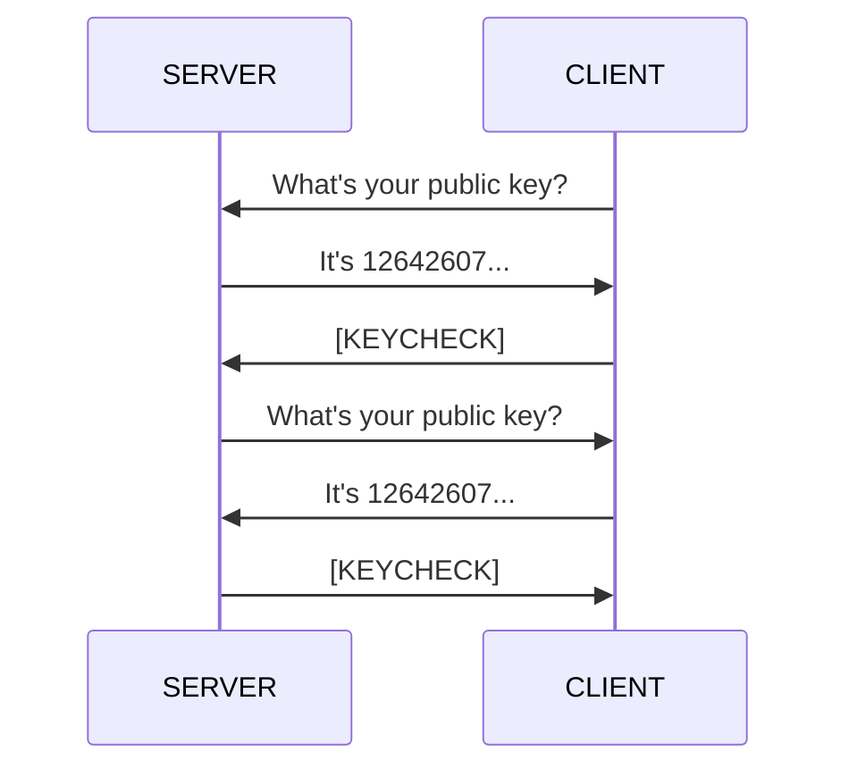

# p2sn

P2SN is a Peer to Peer, encrypted Socket Network written in python.
P2SN uses asymmetric/public key encription ([RSA](https://pypi.org/project/rsa/)) for all\* communication between the two peers.
P2SN uses Base64 (with the '+' and '/' characters) to encode and decode everything\*\*.

\*: Everything, except PUBKEY, pubkey, ERRORKEY, and NULL.

\*\*: Everything, except PUBKEY, ERRORKEY, and NULL

## How does it work

You can read the official P2SN standard in the [`standard.md` file](standard.md).

### Key exchange

_[Can't see it?](https://gist.github.com/koviubi56/aaa2309ce82123b97e29a70354298b41)_

<!-- ! IMPORTANT NOTE: If you edit te diagram below, make sure to edit the fallback diagram above! -->

<!-- ! IMPORTANT NOTE: If you edit te diagram above, make sure to edit the fallback diagram ("Can't see it?")! -->

_b"..."_ means a bytes string.
_\x04_ marks the end of the message, [ASCII code 4](https://theasciicode.com.ar/ascii-control-characters/eot-end-of-transmission-diamonds-card-suit-ascii-code-4.html).
_[KEYCHECK]_ is simply used for checking if the peer received the right key correctly. The bytes b"P2SN:KEYCHECK" are encrypted.
_[ERRORKEY]_ is b"P2SN:ERRORKEY"

The client and the server must have a public, and a private RSA key. Minimum recommended keysize: 1024 bits.

- Client connects to server.
- Client sends b"P2SN:PUBKEY\x04"
- Server sends its public key saved with [pkcs1](https://en.wikipedia.org/wiki/PKCS_1) [PEM](https://en.wikipedia.org/wiki/Privacy-Enhanced_Mail) encoded with Base64 + b"\x04"
- Client sends encrypted [KEYCHECK] encoded with Base64 + b"\x04"
  - If error happens, server replies with [ERRORKEY] + b"\x04"
- Server sends b"P2SN:PUBKEY\x04"
- Client sends its public key saved with [pkcs1](https://en.wikipedia.org/wiki/PKCS_1) [PEM](https://en.wikipedia.org/wiki/Privacy-Enhanced_Mail) encoded with Base64 + b"\x04"
- Server sends encrypted [KEYCHECK]
  - If error happens, client does nothing.

### Communicating

The client must be initialized. The client is initialized if its connected to the server, and the key exchange successfully happened (see above).

- Client sends message encrypted with the server's public key, encoded with Base64 + b"\x04"
- Server replies with message encrypted with the client's public key, encoded with Base64 + b"\x04"
